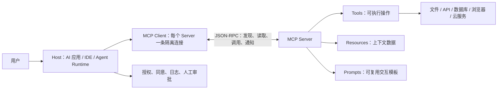

# MCP 基础：让 Agent 安全地连接真实世界

> Day 3 学习资产。本文基于 [MCP Architecture overview](https://modelcontextprotocol.io/docs/learn/architecture) 与 [MCP Architecture specification](https://modelcontextprotocol.io/specification/2025-06-18/architecture/index) 整理；协议与 SDK 会演进，实施前应复核最新版规范。

## 一句话理解

**MCP（Model Context Protocol）是 AI 应用连接外部工具、数据和交互模板的标准协议。** 它解决的是“怎样以一致的方式发现、描述和调用能力”，而不是替模型做决定，也不是自动授予计算机控制权。

## 为什么 Agent 能“操作电脑”

严格来说，Agent 不是通过 MCP 直接操作电脑。实际链路是：

1. MCP Server 暴露一个明确的工具，例如 `read_file`、`query_orders` 或 `browser_click`。
2. Host 将工具名称、说明和输入 Schema 提供给模型。
3. 模型根据用户目标提出工具调用请求。
4. Host 依据权限、用户同意和安全策略决定是否执行。
5. MCP Server 在其被授予的系统权限范围内执行，并返回结果。

因此，**真实能力和风险来自工具权限，不来自 MCP 名称本身。** 高风险动作（支付、退款、删除、发送正式消息）必须默认需要人工审批。

## 架构

MCP 采用 Host–Client–Server 架构：Host 负责管理连接、用户授权和 LLM 集成；每个 Client 与一个 Server 保持隔离连接；Server 暴露可发现的能力。数据层以 JSON-RPC 定义生命周期、能力协商、工具/资源/Prompt/通知；传输层处理本地 `stdio` 或远程 Streamable HTTP 的连接与认证。

## 三种核心能力

| 能力 | 用途 | AI Company OS 示例 |
| --- | --- | --- |
| Tools | 执行有输入输出的操作 | 查询订单、读取任务状态、生成诊断报告 |
| Resources | 提供可读取的上下文数据 | 知识库条目、指标快照、运行日志摘要 |
| Prompts | 提供可复用交互模板 | 退款审核、故障复盘、周报模板 |

## 一次工具调用的最小流程

1. **初始化与能力协商：** Client 与 Server 交换版本和支持的能力。
2. **发现：** Client 读取可用的 tools/resources/prompts 清单。
3. **选择：** Host 将相关工具提供给模型，模型提出调用及参数。
4. **授权：** Host 按用户同意、策略和风险等级允许、拒绝或要求人工确认。
5. **执行与回传：** Server 验证参数和授权，执行最小权限操作，返回结构化结果。
6. **记录：** 将 `task_id`、`session_id`、`trace_id`、调用结果、耗时和错误写入运行治理系统。

## AI Company OS 的 MCP 边界

### 第一阶段：只读优先

首先只开放低风险、可审计能力：读取项目文档、查询任务状态、读取脱敏运行指标、检索知识库。不要在没有审批链路前暴露写库、退款、删除文件、发送外部消息等工具。

### 第二阶段：草稿与审批

允许 Agent 生成代码草稿、客服回复草稿、退款建议和工作流变更提案，但由人审核后才写入或发送。

### 第三阶段：受控执行

仅对幂等、可回滚、低风险且有完整审计日志的任务开放自动执行。所有执行工具都应做输入校验、权限校验、限流、超时和清晰的错误返回。

## 与运行治理的连接

MCP 工具调用必须接入 [`observability/`](../observability/README.md)：

- 每次调用关联 `task_id`、`session_id`、`trace_id`。
- 记录工具名称、参数的脱敏摘要、发起人、授权结果、耗时、成本、输出摘要和错误。
- 不将 API Key、完整客户内容或私密资源写入日志。
- 对失败、超时、拒绝和人工审批建立可查询事件。

## Day 3 验收

- [x] 能说明 MCP 的 Host、Client、Server 与 Tools/Resources/Prompts 的关系。
- [x] 能解释 MCP 与“电脑控制”的区别及权限来源。
- [x] 完成一张调用链架构图。
- [x] 为 AI Company OS 定义只读优先、审批后写入、受控执行三层边界。
- [ ] 运行一个 MCP Server Demo（下一个动手任务）。
